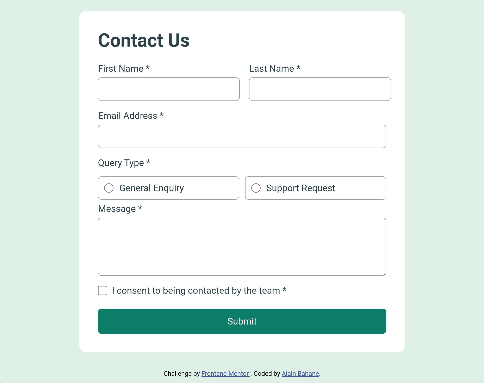

# Frontend Mentor - Contact form solution

🔗 Challenge: https://www.frontendmentor.io/challenges/contact-form--G-hYlqKJj

This is a solution to the Contact form challenge on Frontend Mentor. Frontend Mentor challenges help you improve your coding skills by building realistic projects. 


## Table of contents

- [Overview](#overview)
  - [The challenge](#the-challenge)
  - [Screenshot](#screenshot)
  - [Links](#links)
- [My process](#my-process)
  - [Built with](#built-with)
  - [What I learned](#what-i-learned)
  - [Continued development](#continued-development)
  - [Useful resources](#useful-resources)
  - [AI Collaboration](#ai-collaboration)
- [Author](#author)
- [Acknowledgments](#acknowledgments)


## Overview

### The challenge

Users should be able to:

- Complete the form and see a success toast message upon successful submission  
- Receive form validation messages if:  
- A required field has been missed  
- The email address is not formatted correctly  
- Complete the form only using their keyboard  
- Have inputs, error messages, and the success message announced on their screen reader  
- View the optimal layout for the interface depending on their device's screen size  
- See hover and focus states for all interactive elements on the page  


### Screenshot




### Links

- Solution URL: https://github.com/alainbahanep/frontend-mentor-contact-form  
- Live Site URL: https://alainbahanep.github.io/frontend-mentor-contact-form  


## My process

### Built with

- Semantic HTML5 markup  
- CSS custom properties  
- Flexbox  
- Mobile-first workflow  
- Vanilla JavaScript for form validation  


### What I learned

This project helped me better understand how to build accessible and responsive forms using semantic HTML and clean CSS.

I learned how to:
- Structure a form properly using labels, inputs, and fieldsets  
- Hide error messages by default and display them only when needed  
- Validate user input using JavaScript in a simple and effective way  
- Build responsive layouts using Flexbox (especially for aligning fields horizontally on desktop)  

Example:

```html
<div class="form-group">
  <label for="email">Email Address *</label>
  <input type="email" id="email" required>
  <span class="error">Please enter a valid email address</span>
</div>


### Continued development

In future projects, I want to:

- Improve my JavaScript validation logic to make it more reusable and scalable  
- Go deeper into accessibility (ARIA roles, screen reader behavior)  
- Achieve more pixel-perfect designs based on UI specifications  
- Learn how to connect forms to a backend for real-world use  


### Useful resources

- https://developer.mozilla.org/ — Helped me understand form validation and accessibility  
- https://css-tricks.com/ — Helped me improve layout and responsive design  


### AI Collaboration

I used ChatGPT during this project.

- I used it to structure my HTML and CSS and to debug issues  
- It helped me understand validation logic and responsive layout  
- What worked well: clear explanations and step-by-step guidance  
- What didn’t work well: I needed to review and understand the solutions instead of copying them directly  


## Author

- **Alain Bahane**
- Frontend Mentor: https://www.frontendmentor.io/profile/alainbahanep  
- Twitter: https://x.com/alainbaha  


## Acknowledgments

Special thanks to my mentor **Salomon Mwilo** and **FreeDev Group members** for guidance and support during this project.